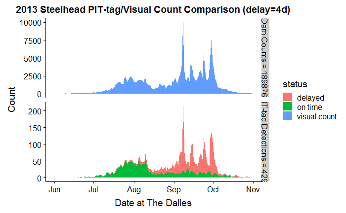

# Columbia_CWR
## Summary
This report is submitted as supplemental data and analysis for the EPA document Columbia River Cold Water Refuges Plan 2019. The main document provided estimates of Cole Water Refuge (CWR) use by Chinook salmon and steelhead using a model which incorporates fish count differential (differences in daily counts at Bonneville and The Dalles dams adult fish ladders) and limited radio-tagging experiments in 2000 and 2002. This report describes similar estimates using PIT-tag detection data, providing additional evidence as to the nature and extent of the inter-dam migrational delay for these species for years 2013-2019 (PIT-tag interrogation began at The Dalles in 2013).

1. The measured incidence of migrational delay (or protracted inter-dam transit time) of adult steelhead, and to a much lesser extent Fall Chinook salmon, between Bonneville and The Dalles dams using PIT-tag detections is consistent with previous studies using radio-tagged fish indicating the use of cold water refuges (CWR), although the locations and paths of PIT-tagged fish in between detection sites cannot be determined.
1. Onset of delay is described as the point in the migration season where the probability of a fish having an unusually long BON-TDD transit time increases, and this coincides with dam scroll case temperatures above 20-21C. The lessening of this probability coincides with water temperatures decreasing below that threshold.
1. The time series of PIT-tag detections of steelhead at The Dalles Dam often indicate one or more narrow peaks in arrivals, and these fish have Bonneville departures distributed across the span of the delay period (#2, above). 
1. In year 2013, for example, large numbers of steelhead, having departed Bonneville Dam over a span of two months, nonetheless ascended The Dalles Dam adult ladders on a single day (almost 10,000 on 9/8/2013).

## Methods
PIT-tag detections for Chinook and Steelhead were obtained from the PTAGIS database (https://ptagis.org/). A query of type “Interrogation Summary” was created, which retrieves the first and last detections (timestamp) at each interrogation site. Other attributes output in the search results included unique tag (one for each fish), run (e.g. Summer, Fall…), rear-type (Natural Origin or Wild, Hatchery), release site (PTAGIS code, basin, subbasin) and species.
This study was focused on adults migrating upstream between Bonneville and The Dalles dams on the Columbia River. The following interrogation sites were of most interest:

PTAGIS code |	Site Name
------------ | -------------
BO1	| Bonneville Bradford Island Ladder
BO4	| Bonneville WA Ladder Slots
TD1	| The Dalles East Fish Ladder
TD2	| The Dalles West Fish Ladder

The two BON (Bonneville Dam) sites are starting points for the path between dams, whereas the TDA (The Dalles) sites are the destination points. Sites at upstream dams were included in the query to provide evidence that a fish detected at BON but not TDA nevertheless passed The Dalles Dam undetected, although the true fate of undetected fish above Bonneville remains uncertain for fish not subsequently detected upstream.
Daily measurements for Columbia River mainstem adult ladder fish counts, water flow, and temperature were obtained from University of Washington DART site (http://www.uw.dart.edu) which compiles data from the US Army Corps of Engineers and WA state public utility districts.
Raw data was processed using the R programming language within the RStudio integrated development language, and this environment was also used to produce the graphics in this report.

## Results
### Scatterplot+Histograms+Temperature of PIT-tag Detection Pairs

There are four components to the above chart:
1. Scatterplot of detection datetime at Bonneville (the last adult detection at one of the BON adult sites) vs. the first detection datetime at The Dalles. The color encoding is red= “delayed” and blue=”not delayed”. This is a binary classification in which a threshold travel time between dams is chosen so as to This is arbitrary, but as you can observe in the above, is a reasonable choice. In any case, for the clearly delayed steelhead, there are rather interesting patterns in both the vertical and horizontal directions. This scatterplot doesn’t give a provide a clear assessment of the relative number of fish delayed, though, since a lot of blue dots might be overlapping near the apparent diagonal.
1. At the top is a histogram of the detections, aggregated by date at (leaving) BON, with the same color encoding. This is of course the arrival rate, and the relative height of red to blue at a given day corresponds to the fraction which will take longer than tmax (or 4 days) to get to TDA
1. On the left is the corresponding histogram for arrivals at The Dalles, rather different, and highly structured profile from the top. Clearly, many of the fish which depart Bonneville from July into August don’t arrive until September-October, but more interestingly, they arrive in bunches (OK, schools), with each group including fish with a large spread of travel times.
1. Inset at the bottom is the forebay daily mean temperature at Bonneville (degrees C). This provides one measure of the reservoir temperature around the time that the fish finally arrive at TDA (as shown below). One could also use temperatures at TDA tailrace (or some average), but there is minimal difference between these. Also apparent is the temperatures at which the probability of delay becomes large.

### Effect of Rear Type

### Effect of Transport

### Effect of Release Basin

## Probability of Delay or Loss

## Composite Results 2013-2019

### Probability of Delay/Loss vs. River Temperature

### Aggregate Delay and Loss

## Comparison with Adult Fish Ladder Visual Count at The Dalles Dam

## Discussion
Discussion
Here I will state the obvious:

Many steelhead take longer than 4 days to travel between Bonneville and The Dalles
1. Groups of fish often arrive at TDA at a date irrespective of their travel time (or date at BON)
1. The probability of being delayed increases with temperature
1. From PIT-tag data alone, it is not possible to discern what each fish was doing in between detections, where they spent their time.
1. There are various possible explanations, of varying degree of likelihood, but I will describe one model which is consistent with the PIT-tag results and the prior work using radio-tagged fish. I call it:

### Bar Hopping Model
Consider a street with several drinking establishments, but different closing times. As one bar closes, the patrons there move on down the street and some of them stop at the next open bar while others just go home (or maybe another open one). And when that second one closes, the bar hopping repeats and so forth until all bars are closed for the night.

Similarly, consider the reservoir above Bonneville with a several cool water refuges between there and The Dalles. Some fish just want to get to The Dalles as fast as possible, while others stop at the nearest spot (CWR) to cool off for a while. The fish in a hurry are (close to) the blue diagonal in the scatterplot chart(s). The fish in the CWR stay there until something prompts them to leave (perhaps a trigger low temperature differential between the CWR and the reservoir). Some of the those departing swim all the way to The Dalles (yielding a peak in the TDA arrival distribution determined by the CWR “closing time” plus the brief direct travel time from that CWR location to TDA while some stop at the next CWR along the way. This repeats until all CWR have "kicked out all of their customers" (some, sadly, never make it home).

### Rest Stop Model

This can be contrasted with a “Rest Stop” model, where some fish stop and spend some time (a distribution around some mean delay) before moving on. This model is not consistent with the PIT-tag analysis presented above, however. Arrival time is either closely correlated with BON departure time – or uncorrelated (the peaks in the TDA arrival distribution).

### ICE Detention Model 

Of course, the CWR are not likely lined up geographically in order of “closing time”, and thus it might not be possible to assign a given arrival peak with a particular CWR. But complementary radio tag data might provide the correlation. The PIT-tag data is readily available with much larger sample sizes than practical with radio tags, and the confounding factor of fish distress after being cut open at the Bonneville AFF is avoided.

